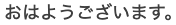

#### Description:

```
Translating text from image
Work better in high quality

Library used:
open-cv
textblob
pytesseract
pycountry
```

#### Requirements

```
python3.9 and above
```

#### Setup your environment:

```
python -m venv venv
source venv/bin/activate
```

#### Installation:

```
python -m pip install -r requirements.txt
python -m textblob.download_corpora
```

#### How to run:

```
put your image in the root folder

python img_trans.py --image your_image_name --from_lang from_language_code --to_lang to_language_code
```

#### Example:

example.png:


```
python img_trans.py --image example.png --from_lang ja --to_lang en

ORIGINAL
========
おはようございます。

TRANSLATED
==========
good morning.
```

```
python img_trans.py --image example.png --from_lang ja --to_lang vi

ORIGINAL
========
おはようございます。

TRANSLATED
==========
buổi sáng tốt lành.
```

#### Note:

```
For language codes use ISO 639-1 Code
https://www.loc.gov/standards/iso639-2/php/code_list.php
```
